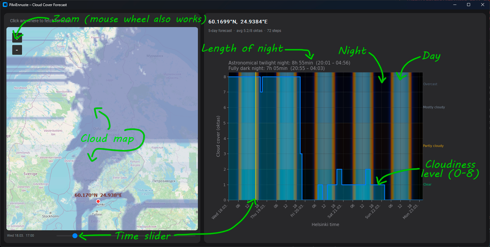

# PilviEnnuste

A desktop cloud cover forecast app for Finland, built for **astrophotographers and anyone hunting for cloudless skies**. See at a glance when and where skies will clear up — up to 5 days ahead.

---

## What it does

PilviEnnuste fetches cloud cover forecasts from the Finnish Meteorological Institute (FMI) and presents them in two complementary views side by side:

- **Map panel (left):** A zoomable map of Finland with a semi-transparent cloud cover overlay. The overlay shows predicted cloudiness across the whole country at a glance, colour-coded by okta level (0 = clear, 8 = overcast).
- **Forecast chart (right):** A detailed hourly cloud cover graph for a selected location, expressed in oktas (0–8). The chart background is shaded to reflect the time of day — deep night, twilight, and daylight — so it's immediately obvious when astronomical conditions are favourable.

---

## How to use it



### Selecting a location

Click anywhere on the map to select a location. The app fetches a point forecast for that spot and updates the chart on the right. Helsinki is selected automatically on startup.

### Reading the chart

- The **y-axis** shows cloud cover in oktas (0 = perfectly clear, 8 = fully overcast).
- The **x-axis** shows time in Helsinki local time, with 6-hour gridlines. Midnight ticks show the date.
- The **background shading** reflects solar altitude: pitch black during astronomical night, gradually brightening through twilight into daylight.
- A dashed **"now" line** marks the current time.
- An **amber line** tracks the time selected with the slider below the map.
- Hovering the mouse over the chart shows a datatip with the exact okta value and time.
- Scroll the mouse wheel over the chart to zoom in on a time range; click and drag to pan; double-click to reset to the full view.

### Night duration summary

Above the chart, two lines show how long the night lasts on the next calendar day at the selected location:

- **Astronomical twilight night** — the period when the sun is more than 12° below the horizon (sky is dark enough for most deep-sky work).
- **Fully dark night** — the period when the sun is more than 18° below the horizon (true astronomical darkness, no twilight glow).

Start and end times are shown in local time for the selected location.

### Map overlay and time slider

The slider below the map steps through the forecast in 3-hour increments. Drag it to any forecast time to see the predicted cloud cover painted across the entire map. Clear areas are transparent; heavier cloud cover appears as progressively darker blue-grey shading.

Pan and zoom the map freely — the overlay updates to match the current view.

---

## Data sources

All forecast data comes from FMI's open data services:

| Data | Source |
|------|--------|
| Point forecast (chart) | FMI WFS stored queries — HARMONIE 0–48 h blended with Scandinavian model 48–120 h |
| Grid overlay (map) | FMI direct download API — `pal_skandinavia` NetCDF, ~7 km resolution, 0–120 h at 3 h steps |

---

## Download

A pre-built Windows executable is available on the [Releases page](https://github.com/aloytyno/CloudForecast/releases/latest).

**[⬇ Download PilviEnnuste.exe](https://github.com/aloytyno/CloudForecast/releases/download/v1.0.0/PilviEnnuste.exe)**

Just download and run — no installation or Python required. Windows may show a security warning on first launch since the executable is unsigned; click **"More info → Run anyway"** to proceed.

---

## Installation (from source)

1. Clone the repository.
2. Create and activate a Python virtual environment:
   ```powershell
   python -m venv venv
   ```
   > **Note:** PowerShell may block the activation script due to execution policy. Instead of activating, invoke the venv's Python directly:
   ```powershell
   .\venv\Scripts\python.exe -m pip install -r requirements.txt
   ```
3. Run the app:
   ```powershell
   .\venv\Scripts\python.exe main.py
   ```

Requires Python 3.11 or later.

---

## Building a standalone executable

You can package the app into a single `.exe` using PyInstaller:

```powershell
.\venv\Scripts\python.exe -m pip install pyinstaller
.\venv\Scripts\python.exe -m PyInstaller pilviennuste.spec
```

The executable is written to `dist\PilviEnnuste.exe` (~70 MB). No Python installation is required to run it — just share the `.exe`.
